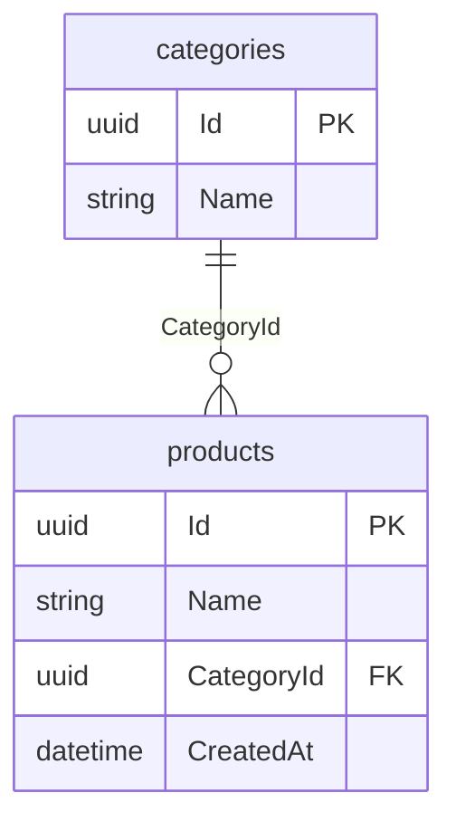

# EF Docs Generator

A .NET 10 tool that generates documentation from Entity Framework Core models, including Mermaid ER diagrams and per-entity markdown documentation.

## Requirements

- .NET 10 SDK or later
- Target assembly must be built for .NET 10

## Features

- **Mermaid ER Diagrams** - Generates entity-relationship diagrams in Mermaid format, viewable on GitHub, GitLab, and other markdown renderers
- **Per-Entity Documentation** - Creates individual markdown files for each entity with columns, indexes, and relationships
- **Notes Preservation** - User-added notes in entity docs are preserved when regenerating
- **Multiple DbContext Support** - Auto-detects or lets you specify which DbContext to document
- **Flexible Instantiation** - Works with design-time factories, parameterless constructors, or DbContextOptions constructors
- **Configurable Output** - Options for table names vs entity names, audit column exclusion, and more

## Installation

### As a Global Tool

```bash
dotnet tool install -g EfDocsGenerator
```

### As a Local Tool

```bash
dotnet new tool-manifest # if you don't have one
dotnet tool install EfDocsGenerator
```

## Usage

```bash
# Generate docs from a compiled assembly
ef-docs -a ./bin/Debug/net10.0/MyApp.dll

# Specify a DbContext when multiple exist
ef-docs -a ./bin/Debug/net10.0/MyApp.dll -c MyDbContext

# Custom output locations
ef-docs -a ./bin/Debug/net10.0/MyApp.dll -o docs/schema.md -d docs/entities

# List available DbContext types
ef-docs -a ./bin/Debug/net10.0/MyApp.dll --list-contexts

# Generate only the ER diagram (no entity docs)
ef-docs -a ./bin/Debug/net10.0/MyApp.dll --no-entity-docs
```

## Command Line Options

| Option | Short | Description | Default |
|--------|-------|-------------|---------|
| `--assembly` | `-a` | Path to assembly containing DbContext (required) | |
| `--startup-assembly` | `-s` | Path to startup assembly for design-time services | |
| `--context` | `-c` | DbContext class name (auto-detected if only one) | |
| `--output` | `-o` | Output path for Mermaid ER diagram | `schema.md` |
| `--docs` | `-d` | Output directory for entity documentation | `docs/entities` |
| `--list-contexts` | `-l` | List all DbContext types and exit | |
| `--use-table-names` | | Use database table names in diagrams (default) | |
| `--use-entity-names` | | Use CLR entity class names instead | |
| `--exclude-audit` | | Exclude audit columns from output | |
| `--audit-columns` | | Comma-separated list of audit column names | See below |
| `--exclude-owned` | | Exclude owned type properties | |
| `--expand-many-to-many` | | Show junction tables for M:N relationships | |
| `--no-entity-docs` | | Skip generating individual entity docs | |
| `--exclude` | | Comma-separated list of entities to exclude | |

### Default Audit Columns

When using `--exclude-audit`, these columns are excluded by default:
- `CreatedAt`, `UpdatedAt`
- `CreatedBy`, `UpdatedBy`
- `DeletedAt`, `DeletedBy`
- `IsDeleted`

Override with `--audit-columns`:

```bash
ef-docs -a ./bin/Debug/net10.0/MyApp.dll --exclude-audit --audit-columns "Created,Modified,Deleted"
```

## Output Examples

### ER Diagram

The generated `schema.md` contains a Mermaid diagram:



### Entity Documentation

Each entity gets a markdown file (`docs/entities/products.md`):

```markdown
# products

**Schema:** `public`
**Table:** `products`
**Entity:** `Product`

## Primary Key

- `Id`

## Columns

| Column | Type | Nullable | Key | Default | Description |
|--------|------|----------|-----|---------|-------------|
| `Id` | `uuid` | No | PK | | |
| `Name` | `text` | No | | | |
| `CategoryId` | `uuid` | No | FK->categories | | |

## Relationships

- **products** (`CategoryId`) -> **categories** (`Id`)

## Notes

<!-- NOTES_START -->
<!-- Add your notes here. This section is preserved when regenerating. -->
<!-- NOTES_END -->
```

## DbContext Instantiation

The tool tries multiple strategies to create your DbContext:

1. **IDesignTimeDbContextFactory<T>** - If you have a design-time factory, it will be used
2. **Parameterless constructor** - If available
3. **DbContextOptions constructor** - Creates options with SQLite in-memory provider (just to build the model)

If your DbContext requires services from DI, implement `IDesignTimeDbContextFactory<T>`:

```csharp
public class MyDbContextFactory : IDesignTimeDbContextFactory<MyDbContext>
{
    public MyDbContext CreateDbContext(string[] args)
    {
        var options = new DbContextOptionsBuilder<MyDbContext>()
            .UseSqlite("Data Source=:memory:")
            .Options;

        return new MyDbContext(options);
    }
}
```

## CI/CD Integration

Add documentation generation to your build pipeline:

```yaml
# GitHub Actions example
- name: Generate EF Documentation
  run: |
    dotnet tool restore
    dotnet build
    dotnet ef-docs -a ./src/MyApp/bin/Debug/net10.0/MyApp.dll -o docs/schema.md -d docs/entities

- name: Commit documentation changes
  uses: stefanzweifel/git-auto-commit-action@v5
  with:
    commit_message: "docs: update EF schema documentation"
    file_pattern: "docs/**/*.md"
```

## Building from Source

```bash
git clone https://github.com/mtherien/ef-docs-generator.git
cd ef-docs-generator
dotnet build
dotnet pack

# Install locally for testing
dotnet tool install --global --add-source ./src/EfDocsGenerator/nupkg EfDocsGenerator
```

## License

MIT License - see [LICENSE](LICENSE) for details.
